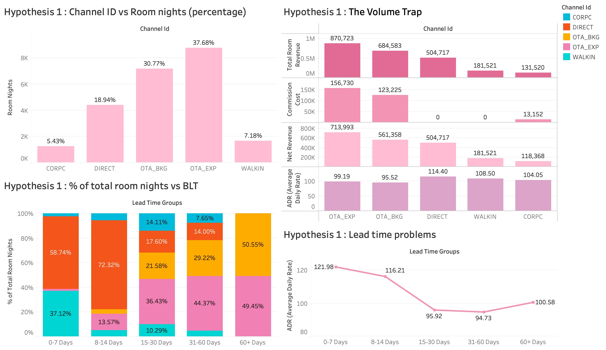
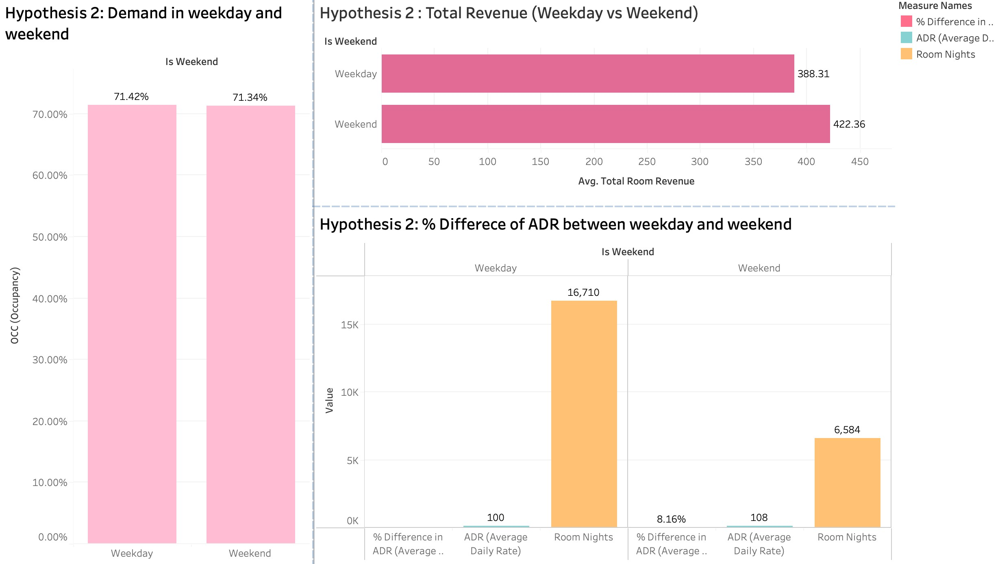
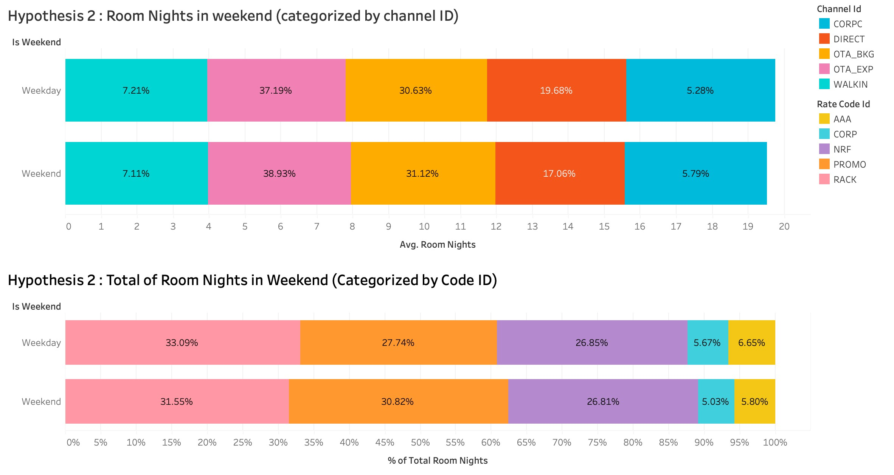
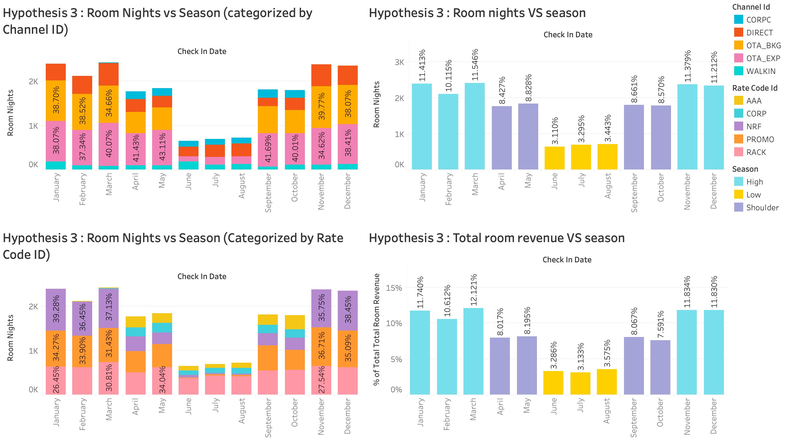
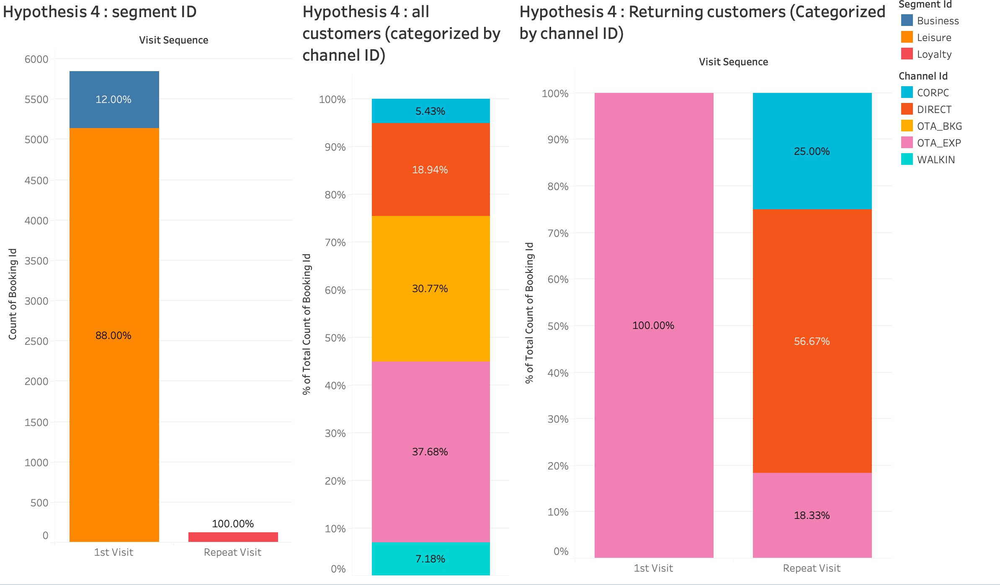
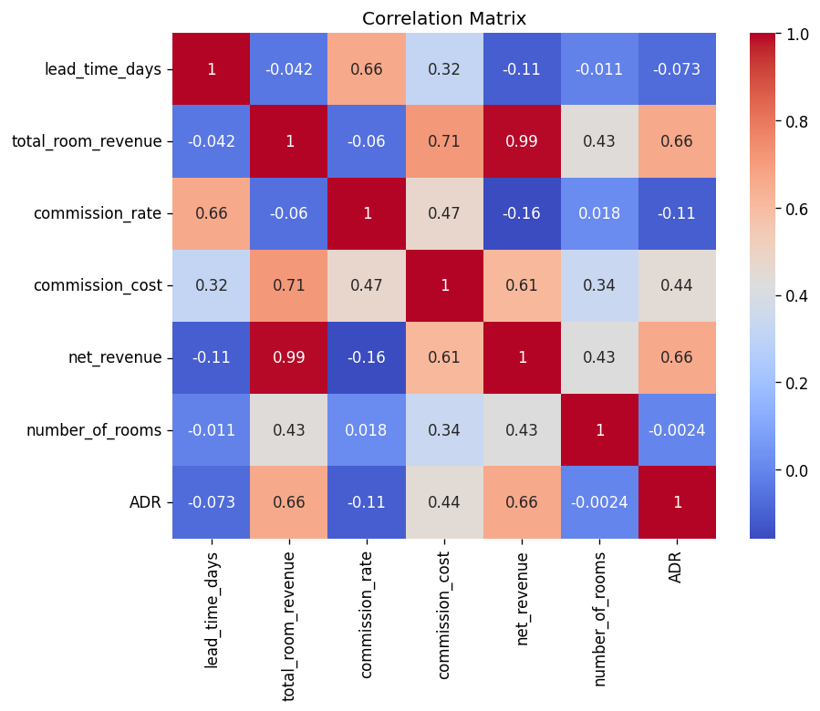

# CP372-DATA-ANALYTICS-PROJECT

# Synthetic Hotel Dataset Generator (Revenue Management Simulation)

## Objective
Act as a Data Engineer and Revenue Management Expert. Generate a synthetic hotel dataset in .xlsx format for the year 2025 (Jan 1 – Dec 31).

The dataset must contain 5 relational tables, each placed in a separate worksheet in the Excel file. The dataset must simulate a Revenue Stagnation problem where the hotel shows high occupancy but low RevPAR compared to competitors.

---

## 1. Hotel Configuration

Total hotel capacity is 90 rooms.

Room types exist for pricing and booking purposes and must follow this structure:

SLG (Single): 50 rooms, Base Rate $80, room_type_id rt-01  
DLX (Deluxe): 30 rooms, Base Rate $150, room_type_id rt-02  
STE (Suite): 10 rooms, Base Rate $350, room_type_id rt-03  

Important rule:  
Bookings in fact_bookings must specify room_type_id, but inventory in dim_room_inventory must be calculated at the total hotel level (90 rooms), not by room type.

---

## 2. Seasons

High Season: January to March, November to December  
Shoulder Season: April to May, September to October  
Low Season: June to August  

---

## 3. Table Requirements

The Excel file must contain five worksheets.

### fact_bookings

This table must contain between 5,000 and 7,000 rows. Each row represents one reservation transaction.

Columns:
booking_id (Primary Key), guest_id (pattern g-xxxx such as g-0001), booking_date, check_in_date, check_out_date, room_type_id (rt-01, rt-02, rt-03), rate_code_id, channel_id, segment_id, status (Confirmed, Cancelled, No-Show), total_room_revenue, number_of_rooms, adults_count, children_count

Constraints:
- Length of stay must be between 1 and 3 days only  
- Check-out date must always be after check-in date  
- number_of_rooms must reflect actual rooms booked  
- Room nights must consume total inventory capacity  

---

### dim_room_inventory

This table must contain 365 rows (one per date).

Columns:
date, total_capacity (fixed at 90), rooms_out_of_order, rooms_available_for_sale

Rules:
- Inventory must be pooled at the total hotel level  
- rooms_available_for_sale = total_capacity − rooms_out_of_order  
- rooms_out_of_order + total occupied rooms must never exceed 90  

---

### dim_rate_codes

Must include the following values:
RACK (Rack Rate), AAA (AAA Discount), CORP (Corporate), NRF (Non-Refundable), PROMO (Seasonal Promo)

---

### dim_channels

Must include the following values:
DIRECT (0% commission), OTA_EXP (18%), OTA_BKG (18%), WALKIN (0%), CORPC (10%)

---

### dim_calendar

This table must contain 365 rows.

Columns:
date, day_name, is_weekend, is_holiday, season

---

## 4. Hidden Revenue Management Patterns

The dataset must intentionally simulate revenue management inefficiencies.

### Volume Trap
Overall occupancy should be approximately 75–85%.  
Bookings must be concentrated in rt-01 rooms and OTA channels (OTA_EXP, OTA_BKG), resulting in high occupancy but low ADR and high commission costs.

### Pricing Inefficiency
Weekend pricing must be poorly optimized.  
Weekend revenue should be only 5–10% higher than weekdays despite higher demand.

### Suite Gap
rt-03 occupancy must be less than 20%.  
This should be driven by minimal discounting, very low PROMO usage, and demand shifting toward rt-01.

### Lead Time Problem
High-value demand consists of direct bookings with short lead time (0–14 days).  
Low-value demand consists of OTA bookings with long lead time (30–120 days).  
Low-value demand must block inventory early.

### Seasonality Illusion

High Season Failure:  
During high season, occupancy reaches 95–100% but RevPAR remains low.  
More than 70% of bookings should be made 60–90 days in advance via OTA_EXP and OTA_BKG using PROMO or NRF rates.

Low Season Failure:  
During low season, occupancy drops below 35% due to lack of pricing adaptation.  
PROMO usage should be almost zero during June to August.

---

## 5. Returning Guest Pattern

Exactly 2% of guests must be returning guests.

Returning guests are identified strictly by duplicate guest_id values. Each returning guest must have at least two reservations, and the second booking must occur after the first stay ends.

Distribution:
Approximately 98% one-time guests and 2% repeat guests.

Returning guest behavior:
- 50–60% of bookings via DIRECT or CORPC  
- Higher probability of booking rt-02  
- Shorter lead time (7–21 days)  
- Higher value bookings using RACK or CORP  
- Rare use of PROMO  

---

## 6. Output Format

Write Python code using pandas and openpyxl to generate the dataset and save it as:

hotel_dataset_2025.xlsx

The file must contain five worksheets:
fact_bookings, dim_room_inventory, dim_rate_codes, dim_channels, dim_calendar

All tables must be logically consistent, including:
- Room capacity constraints  
- Booking date validity  
- Maximum stay duration  
- Inventory availability  
- Occupancy calculations  
- Returning guest behavior patterns  

Finally, execute the Python code and generate the actual .xlsx file.

## 1. บทนำและความเป็นมา (Introduction & Background)
ในยุคปัจจุบันที่การจองห้องพักออนไลน์เข้ามามีบทบาทสำคัญ ทำให้โรงแรมรับลูกค้าหลายช่องทางมากขึ้นเพื่อเพิ่มอัตราการเข้าพัก แต่กลับมองข้ามความสำคัญของรายได้สุทธิหลังหักค่าใช้จ่าย จากการวิเคราะห์ข้อมูลเบื้องต้นของโรงแรม พบว่าแม้จะมีตัวเลขการเข้าพักที่น่าพอใจ แต่โครงสร้างรายได้กลับมีความเปราะบางอย่างมีนัยสำคัญ

##SMART Objectives
S (Specific) : แก้ปัญหาด้าน Revenue Stagnation  
M (Measurable) : วัดผลได้ผ่าน ADR , Occupancy ของห้อง Suite ที่เพิ่มขึ้น, และค่าคอมมิชชันที่ลดลง   
A (Achievable) : มีข้อมูลรองรับจาก EDA   
R (Relevant) : สอดคล้องกับปัญหาหลักของ Azure Stay ที่ต้องการ Maximize Profitability  
T (Time-bound) : กำหนดการเห็นผลชัดเจนภายในปีถัดไป  
## 2. วัตถุประสงค์ของโครงการ (Research Objectives)
 - เพื่อวิเคราะห์โครงสร้างและพฤติกรรมข้อมูลธุรกิจโรงแรม
   และศึกษาความสัมพันธ์ของข้อมูลการจอง ช่องทางการขาย และโครงสร้างราคาเพื่อระบุจุดรั่วไหลของรายได้ ผ่านสมมติฐานหลักทั้ง 6 ข้อ
 - เพื่อเสนอแนะแนวทางการบริหารจัดการรายได้เชิงกลยุทธ์   
   สร้างข้อเสนอแนะในกลยุทธ์การตั้งราคาที่เป็นรูปธรรม
 - เพื่อทบทวนและบูรณาการความรู้ในวิชา CP372 Data analytics   
   การนำทฤษฎีและทักษะที่ได้เรียนรู้มาประยุกต์ใช้กับโจทย์ธุรกิจจริง

## 3. คำถามการวิจัยและสมมติฐาน (Research Questions & Hypothesis)
**Hypothesis 1 : The Volume trap** : ระยะเวลาการจองห้องมีผลต่อรายได้หรือไม่

**Hypothesis 2 : Pricing Inefficiency** : การกระตุ้นโปรโมชั่นและช่องทางเลือกในการจองห้องพักส่งผลต่อ ADR ของวันธรรมดาและวันหยุดสุดสัปดาห์หรือไม่ ?

**Hypothesis 3 : The Seasonality Illusion** :  ฤดูกาลมีผลต่อยอดการเข้าพักและรายได้หรือไม่

**Hypothesis 4 : Royalty Leak** :  ลูกค้าเก่ามักจองห้องผ่าน OTA เพื่อลดค่าใช้จ่ายจริงหรือไม่

## 4. ชุดข้อมูลและตัวแปรที่ใช้ (Dataset & Features)
* จำนวนแถวข้อมูล: 5654 แถว
* จำนวนตัวแปรทั้งหมด: 14 ตัวแปร

### Data Dictionary
1. Sheet: fact_bookings

| Attribute | คำอธิบาย | Data Type | ช่วงค่าที่ถูกต้อง / ตัวอย่าง |
|---|---|---|---|
| booking_id | หมายเลขการจอง | Nominal (Text) | b-002266, b-003216 |
| guest_id | หมายเลขผู้เข้าพัก | Nominal (Text) | g-2157, g-3107 |
| booking_date | วันที่ทำการจอง | Interval (Date) | 26/09/2024 |
| check_in_date | วันที่เช็คอิน | Interval (Date) | 01/01/2025 |
| check_out_date | วันที่เช็คเอาท์ | Interval (Date) | 03/01/2025 |
| room_type_id | ประเภทห้องพัก | Nominal | rt-01, rt-02, rt-03 |
| rate_code_id | รหัสอัตราค่าห้อง | Nominal | NRF, PROMO, AAA, RACK, CORP |
| channel_id | ช่องทางการจอง | Nominal | OTA_BKG, OTA_EXP, DIRECT, WALKIN, CORPC |
| segment_id | กลุ่มลูกค้า | Nominal | LEISURE, BUSINESS |
| status | สถานะการจอง | Nominal | Confirmed, Cancelled, No-Show |
| total_room_revenue | รายได้รวมจากห้องพัก (USD) | Ratio (Continuous) | 0 – 4,200 |
| number_of_rooms | จำนวนห้องที่จอง | Ratio (Discrete) | 1 – 4 |
| adults_count | จำนวนผู้ใหญ่ | Ratio (Discrete) | 1 – 8 |
| children_count | จำนวนเด็ก | Ratio (Discrete) | 0 – 4 |

2. Sheet: dim_room_inventory

| Attribute | คำอธิบาย | Data Type | ช่วงค่าที่ถูกต้อง / ตัวอย่าง |
|---|---|---|---|
| date | วันที่ | Interval (Date) | 01/01/2025 |
| total_capacity | จำนวนห้องทั้งหมดของโรงแรม | Ratio (Discrete) | 100 – 500 |
| rooms_out_of_order | ห้องที่ไม่สามารถขายได้ (ซ่อม/ปิดปรับปรุง) | Ratio (Discrete) | 0 – 50 |
| rooms_available_for_sale | ห้องที่พร้อมขาย | Ratio (Discrete) | 50 – 500 |

3. Sheet: dim_rate_codes

| Attribute | คำอธิบาย | Data Type | ช่วงค่าที่ถูกต้อง / ตัวอย่าง |
|---|---|---|---|
| rate_code_id | รหัสอัตราค่าห้อง | Nominal | NRF, PROMO, AAA, RACK, CORP |
| rate_name | ชื่อเรท | Nominal (Text) | Non-refundable, Promotion, Corporate Rate |
| description | รายละเอียดเรท / สิ่งที่รวมอยู่ | Nominal (Text) | Includes Breakfast & Wifi |
| is_commissionable | ระบุว่ามีการจ่ายค่าคอมมิชชั่นหรือไม่ | Boolean | True, False |

4. Sheet: dim_channels

| Attribute | คำอธิบาย | Data Type | ช่วงค่าที่ถูกต้อง / ตัวอย่าง |
|---|---|---|---|
| channel_id | รหัสช่องทางการจอง | Nominal | OTA_BKG, OTA_EXP, DIRECT |
| channel_name | ชื่อช่องทาง | Nominal (Text) | Booking.com, Expedia, Direct |
| channel_type | ประเภทช่องทางการจอง | Nominal | OTA, Direct, Wholesaler |
| commission_pct | เปอร์เซ็นต์ค่าคอมมิชชั่น | Ratio (Continuous) | 0 – 0.30 (เช่น 0.15 = 15%) |

5. Sheet: dim_calendar

| Attribute | คำอธิบาย | Data Type | ช่วงค่าที่ถูกต้อง / ตัวอย่าง |
|---|---|---|---|
| date | วันที่ | Interval (Date) | 01/01/2025 |
| day_name | ชื่อวันในสัปดาห์ | Nominal | Monday, Tuesday |
| is_weekend | เป็นวันหยุดสุดสัปดาห์หรือไม่ | Boolean (0 = False, 1 = True) | 0, 1 |
| is_holiday | เป็นวันหยุดนักขัตฤกษ์หรือไม่ | Boolean (0 = False, 1 = True) | 0, 1 |
| season | ฤดูกาล | Nominal | High, Low, Shoulder |

### ตัวแปรเป้าหมาย (Target Variable)
**Hypothesis 1 : The Volume trap**  
**ตัวแปร :**  
Revenue per Booking : รายได้ต่อการจองหนึ่งครั้ง ADR by Lead Time 
Group : ราคาเฉลี่ยที่ได้ตามระยะเวลาการจอง (0-14 วัน vs 60+ วัน) 

**Hypothesis 2 Pricing Inefficiency**   
**ตัวแปร :**  
ADR (Weekend vs Weekday) : เปรียบเทียบราคาเฉลี่ยต่อห้องระหว่างวันธรรมดาและวันหยุด  
Revenue Opportunity Loss: มูลค่ารายได้ที่หายไปจากการไม่ปรับราคา  

**Hypothesis 3 The Seasonality Illusion**  
**ตัวแปร :**   
Occupancy Rate by Season: อัตราการเข้าพักแยกตามหน้า High และ Low Season  
Yield Percentage: ประสิทธิภาพการทำกำไรในแต่ละเดือน  

**Hypothesis 4 Loyalty Leak**  
**ตัวแปร :**   
Visit Sequence : การเข้าพักของลูกค้าเก่า  

## 5. ระเบียบวิธีวิจัย (Methodology)  
**5.1 Data Cleaning**

 **Table fact bookings**  

 - ไม่พบค่า Missing Values และ มีบางส่วนที่เป็นค่า Duplicate Records
   เนื่องจากการที่ลูกค้ากลับมาใช้ซ้ำ (guest_id)
 - ตรวจสอบและปรับชนิดข้อมูลของตัวแปร (Data Types)   
   ให้เหมาะสมกับการวิเคราะห์

  

  

  

  

ใน **Table room inventory , Table rate codes และ Table channels**

 - ไม่พบค่า Missing Values และ Duplicate Records
 - ตรวจสอบและปรับชนิดข้อมูลของตัวแปร (Data Types)   
   ให้เหมาะสมกับการวิเคราะห์

**Table Calendar**
- ไม่พบค่า Missing Values และ Duplicate Records
- แปลงข้อมูลจาก 1 เป็น TRUE และ 0 เป็น FALSE
   
**5.2 Exploratory Data Analysis (EDA)**

**วิเคราะห์สมมติฐานข้อที่ 1 ปริมาณการจองลวงตา (The Volume Trap)  ระยะเวลาการจองห้องมีผลต่อรายได้หรือไม่**

  

จากกราฟสามารถวิเคราะห์สัดส่วนการจอง (Room Nights) พบว่าโรงแรมตกอยู่ในสภาวะพึ่งพาตัวกลางสูงเกินไป โดยที่ช่องทาง OTA สัดส่วนการจองอยู่ที่ 68.45% และหากรวม CORPC จะเป็น 73.88% Direct & Walk-in ที่เป็นช่องทางที่ทำกำไรสูงสุด มีสัดส่วนเพียง 26.12% ทำให้เราทราบได้ว่าถึงช่องทาง OTA_EXP จะสร้างรายได้รวมอยู่ที่ $870,723$ แต่ต้องจ่ายค่า Commission สูงถึง $156,730$ (คิดเป็นเกือบ 18%) ทำให้รายได้สุทธิลดลง และความสัมพันธ์ระหว่าง Lead Time กับราคา (ADR)

- Early Birds get the lowest price: กลุ่มที่จองล่วงหน้านาน (15-60+ วัน) มีราคาเฉลี่ย (ADR) ต่ำที่สุดอยู่ที่ประมาณ $94.73 - $100.58

- Last Minute Premium: กลุ่มที่จองล่วงหน้าสั้น (0-14 วัน) ยินดีจ่ายแพงกว่า โดย ADR สูงถึง $121.98 ในช่วง 0-7 วันก่อนเข้าพัก

- กลุ่มที่จ่ายแพง (Direct/Walk-in) มักจะจองในระยะกระชั้นชิด แต่ห้องพักส่วนใหญ่กลับถูก ขายหมดไปล่วงหน้าผ่าน OTA ในราคาที่ต่ำกว่าไปแล้ว

ทั้งนี้ผู้จัดทำจึงได้เสนอแนวทางแก้ไขปัญหานี้ หากต้องการที่จะเพิ่มยอดขาย ทางโรงแรมควรที่จะกันห้องไว้สำหรับ direct และ walk in ทำส่วนลดเฉพาะเว็บไซต์โรงแรม (เช่น -5%) ให้สิทธิพิเศษ Late check-out, Free breakfast และลดโควตาห้องที่ขายบน 3rd party ลงเพื่อลดราคาสำหรับการจ่ายค่า commission

**วิเคราะห์สมมติฐานข้อที่ 2 ความไร้ประสิทธิภาพในการตั้งราคาช่วงสุดสัปดาห์ (Pricing Inefficiency)
การปล่อยโปรโมชันเสรีและการไม่ควบคุมช่องทางการจอง ส่งผลต่อการเติบโตของ ADR ในช่วงวันหยุดสุดสัปดาห์ (Weekend) เมื่อเทียบกับวันธรรมดา (Weekday) หรือไม่** 

จากกราฟนี้เป็นการพูดถึงรายได้เฉลี่ยต่อวัน (Average Daily Rate) ในช่วงวันธรรมดาอยู่ที่ 100 ดอลลาร์ และวันหยุดสุดสัปดาห์อยู่ที่ 108 ดอลลาร์ ซึ่งหมายความว่าทางโรงแรมสามารถทำยอดขายได้เพิ่มจากวันธรรมดาเพียงแค่ 8.16% เท่านั้น ซึ่งตรงกับสมมติฐาน และจากยอดความต้องการ ของวันธรรมดาและวันหยุดสุดสัปดาห์ 71.42 และ 71.34 ตามลำดับ พบว่ามีความต้องการในอัตราที่ใกล้เคียงกันดังนั้นจึงไม่สามารถรองรับสมมติฐานเกี่ยวกับความต้องการที่พุ่งขึ้นสูงในช่วงวันหยุดสุดสัปดาห์ได้ จึงดูการใช้ code ID และ channel ID แทน และพบว่าในช่วงวันหยุดสุดสัปดาห์ มีลูกค้าเลือกจ่ายเต็มเพียงแค่ 31.55% และมีลูกค้าที่จองผ่าน OTA รวม 70.25 ทำให้เสียรายได้ในช่วงวันหยุดสุดสัปดาห์ไป

จากกราฟทั้งสาม สามารถสรุปได้ว่า Demand ระหว่างวันธรรมดาและวันหยุดมีระดับใกล้เคียงกัน จึงไม่ใช่ปัจจัยหลักที่ทำให้รายได้แตกต่างกัน ผู้จัดทำจึงวิเคราะห์เพิ่มเติมและพบว่า รายได้ส่วนหนึ่งสูญเสียไปจากค่า Commission ของ OTA และการใช้โปรโมชั่นในระดับสูง

ดังนั้น แนวทางที่ควรพิจารณาคือ หากสามารถปรับสัดส่วนการใช้โปรโมชันในช่วงวันหยุดให้มีการปล่อยโปรโมชันน้อยลง และเน้นการขายห้องผ่านช่องทาง direct/walkin ของทั้งวันธรรมดาและวันหยุดสุดสัปดาห์แทนเพื่อเพิ่มกำไรแทนที่การจ่ายค่า commission 

**วิเคราะห์สมมติฐานข้อที่ 3 กำไรที่สวนทางกับช่วงฤดูกาล (The Seasonality Illusion)
ฤดูกาลมีผลต่อยอดการเข้าพักและรายได้หรือไม่** 

จากแดชบอร์ดจะพบว่าช่วง high season รวมถึงช่วงคาบเกี่ยวอย่าง shoulder จะมีการเข้าพักที่สูงลดหลั่นตามกันมา และทิ้ง gap ระยะห่างของ low season ไว้เยอะ และยอดขายของ high season รวมถึงได้ 58.13 ซึ่งถือว่าอยู่ในเกณฑ์ที่ดี แต่เมื่อดูตัวแปร channel ID และ rate code ID จะพบว่าช่วง high season จะมีอัตราการปล่อยห้องให้จองผ่าน OTA สูงมาก และมีอัตราการใช้ Promotion ที่สูง แต่ในทางกลับกันช่วง low season ที่มียอดขายรวมกันเพียงแค่ 9.99% ที่แทบไม่มีการปล่อยให้จองห้องพักผ่าน OTA หรือการกระตุ้นยอดขายจากการใช้ Promotion

 - การรับมือสำหรับในช่วง High Season จำกัดโควตา ของช่องทาง OTA และ Rate
   Code ประเภท PROMO/NRF ไม่ให้เกิน 30-40% ของจำนวนห้องทั้งหมดในช่วง
   High Season ใช้ระบบจัดการโควตา (Yield Management) เพื่อสงวนห้องพัก
   50-60% ไว้ขายเฉพาะช่องทาง DIRECT และในเรทราคา RACK ในช่วง 1-3
   สัปดาห์ก่อนวันเข้าพัก (Lead Time 0-21 วัน) ซึ่งเป็นช่วงที่ Demand
   ของลูกค้าพร้อมจ่ายสูงสุด และควรระงับการขายผ่านช่องทาง OTA
   ในช่วงวันหยุดยาว
   
 - การรับมือสำหรับในช่วง Low Season โรงแรมควรปรับกลยุทธ์มาอัดโปรโมชัน Flash Sale
   หรือ Buy 1 Get 1 Free (เรท PROMO) เพื่อดึง Volume เข้ามาหล่อเลี้ยง
   Fix Cost และครอบคลุมค่าใช้จ่ายดำเนินงาน ไม่ลดราคาจนเสียสมดุล
   แต่ใช้การแถม (เช่น ฟรีอาหารเช้า, สปา, รถรับส่ง)
   เพื่อกระตุ้นการตัดสินใจ

**วิเคราะห์สมมติฐานข้อที่ 4 การรับมาใช้บริการซ้ำที่น้อยลง(The Loyalty Leak)
ลูกค้าเก่ามักจองห้องผ่าน OTA เพื่อลดค่าใช้จ่ายจริงหรือไม่** 

จากกราฟพบว่าลูกค้าที่กลับมาใช้บริการอีกครั้งน้อยมาก คิดเป็นแค่ 2% เท่านั้น โดยสามารถตีความได้ว่าจากการใช้บริการครั้งแรก ลูกค้าเป็นลูกค้าประเภท Leisure 88% และ 12% เมื่อผนวกกับข้อมูลจากข้อสันนิษฐานก่อนหน้า จึงสามารถสรุปได้ว่าลูกค้าส่วนใหญ่เป็นชาวต่างชาติ จากลูกค้าส่วนใหญ่มีพฤติกรรมชอบจองห้องล่วงหน้านาน และยอด demand ของวันธรรมดา และวันหยุดสุดสัปดาห์ใกล้เคียงกัน

และจากข้อสันนิษฐานว่าลูกค้าเก่าจองผ่านรูปแบบ OTA เพื่อลดค่าใช้จ่าย ถือว่าไม่เป็นความจริง แต่กลับกันจากการจอง OTA 100% ในครั้งแรก กลับเหลือเพียง 18.33% ในการใช้บริการครั้งที่สอง ถือว่าทางโรงแรมประสบความสำเร็จในการดึงดูดลูกค้าเพื่อจองห้องพักผ่านโรงแรมโดยตรง

ทั้งนี้ผู้จัดทำจึงได้เสนอแนวทางแก้ไขปัญหา โดยการสร้างระบบ membership สะสมแต้มเพื่อดีงดูดให้ลูกค้าจากกลับมาใช้บริการ และทำ personalized offer ผ่านช่องทาง Email

**เมทริกซ์สหสัมพันธ์ของการทำกำไรของโรงแรมและตัวแปรจากทั้ง 5 สมมติฐาน**

จากกราฟวิเคราะห์ความสัมพันธ์ แสดงให้เห็นถึงความเชื่อมโยงของปัจจัยต่าง ๆ ที่ส่งผลกระทบต่อโครงสร้างรายได้ของโรงแรมที่ช่วยยืนยันสมมติฐานการวิเคราะห์
- ความสัมพันธ์ระหว่าง total_room_revenue และ net_revenue อยู่ที่ 0.99 เมื่อพิจารณาประกอบกับค่า commission_rate ที่มีค่าความสัมพันธ์ติดลบกับ net_revenue (-0.16) ทำให้เราทราบได้ว่าสัดส่วนค่าคอมมิชชันสูงขึ้น รายได้สุทธิจะยิ่งถูกลงมา 
- ความสัมพันธ์ระหว่าง total_room_revenue และ commission_cost อยู่ที่ 0.71 บอกเราว่าโรงแรมมักพึ่งแต่การขายห้องผ่านตัวกลาง ยิ่งโรงแรมพยายามดันยอดจองให้สูงขึ้น  ต้นทุนค่าคอมมิชชันก็พุ่งสูงขึ้นตาม 
- ความสัมพันธ์ระหว่าง lead_time_days และ commission_rate อยู่ที่ 0.66 ซึ่งเป็นค่าความสัมพันธ์เชิงบวกที่ค่อนข้างสูง ยิ่งลูกค้าจองล่วงหน้านานเท่าไหร่ มีแนวโน้มสูงมากที่การจองนั้นจะผ่านช่องทางที่มีค่าคอมมิชชันสูง (OTAs) สอดคล้องกับพฤติกรรมที่เราวิเคราะห์ไว้ก่อนหน้านี้ว่า กลุ่ม Early Bird มักเป็นกลุ่มที่จองผ่าน OTA ในขณะที่ลูกค้า Direct/Walk-in มักจองในระยะสั้น ซึ่งการจองระยะสั้นมีค่าความสัมพันธ์กับค่าคอมมิชชันที่ต่ำกว่า (สังเกตจากค่าติดลบอ่อนๆ ระหว่าง Lead Time กับ ADR ที่ -0.073)

ยิ่งเป็นการเน้นว่าปัญหาที่โรงแรมมีรายได้แต่ขาดการทำกำไรนั้นเกิดมาจากการที่เรามักทำการตลาดผ่านตัวกลางทำให้เสียค่าคอมมิชชันในราคาที่สูงเกินไป

## 6. Business Insights

**วิเคราะห์สมมติฐานข้อที่ 1 ปริมาณการจองลวงตา (The Volume Trap)**  
หลังจากการวิเคราะห์เราได้พบว่าโรงแรมพึ่งพาช่องทาง OTA_BKG, OTA_EXP และ CORPC สูงถึง 73.88% (โดยเป็น OTA 68.5%) ขณะที่ช่องทางที่โรงแรมได้รับรายได้เต็มจำนวน ได้แก่ Direct และ Walk-in มีสัดส่วนรวมเพียง 26.12% เท่านั้น แม้ว่า OTA จะเป็นช่องทางหลักที่สร้างรายได้สูงตามกราฟ Total Room Revenue แต่ก็มาพร้อมต้นทุนค่า Commission ที่สูง ส่งผลให้โรงแรมสูญเสียรายได้รวมถึง 293,137 ดอลลาร์ นอกจากนี้ ลูกค้าส่วนใหญ่เลือกห้อง rt-01 มากกว่า rt-03 อย่างชัดเจน

**วิเคราะห์สมมติฐานข้อที่ 2 ความไร้ประสิทธิภาพในการตั้งราคาช่วงสุดสัปดาห์ (Pricing Inefficiency)**   
โดยในช่วงวันหยุดสุดสัปดาห์มักมีความต้องการมากกว่าวันธรรมดาเสมอ แต่จากยอดความต้องการ ของวันธรรมดาและวันหยุดสุดสัปดาห์ 71.42 และ 71.34 ตามลำดับ พบว่ามีความต้องการในอัตราที่ใกล้เคียงกันดังนั้นจึงไม่สามารถรองรับสมมติฐานเกี่ยวกับความต้องการที่พุ่งขึ้นสูงในช่วงวันหยุดสุดสัปดาห์ได้ จากกราฟก่อนหน้าที่เป็นการพูดถึงรายได้เฉลี่ยต่อวัน (Average Daily Rate) ในช่วงวันธรรมดาอยู่ที่ 100 ดอลลาร์ และวันหยุดสุดสัปดาห์อยู่ที่ 108 ดอลลาร์ ซึ่งหมายความว่าทางโรงแรมสามารถทำยอดขายได้เพิ่มจากวันธรรมดาเพียงแค่ 8.16% เท่านั้น  และเมื่อดู Code rate id มีการใช้ promo ของวันหยุดสุดสัปดาห์ 30.82% และวันธรรมดา 27.74 % เมื่อเทียบกับ demand ของทั้งสองที่สูงมาก ทำให้เกิดการสูญเสียรายได้ไปโดยใช่เหตุ นอกจากนี้ยังมีการจองผ่าน OTA กว่า 60% ทำให้มีต้นทุนเพิ่มมากขึ้น 

**วิเคราะห์สมมติฐานข้อที่ 3 กำไรที่สวนทางกับช่วงฤดูกาล (The Seasonality Illusion)**   
จะพบว่าช่วง high season รวมถึงช่วงคาบเกี่ยวอย่าง shoulder จะมีการเข้าพักที่สูงลดหลั่นตามกันมา และทิ้ง gap ระยะห่างของ low season ไว้เยอะ และยอดขายของ high season รวม 58.13% ซึ่งถือว่าอยู่ในเกณฑ์ที่ดี แต่เมื่อดูตัวแปร channel ID และ rate code ID จะพบว่าช่วง high season จะมีอัตราการปล่อยห้องให้จองผ่าน OTA สูงมาก และมีอัตราการใช้ Promotion ที่สูง แต่ในทางกลับกันช่วง low season ที่มียอดขายรวมกันเพียงแค่ 9.99% แต่แทบไม่มีการปล่อยให้จองห้องพักผ่าน OTA หรือการกระตุ้นยอดขายจากการใช้ Promotion

**วิเคราะห์สมมติฐานข้อที่ 4 การรับมาใช้บริการซ้ำที่น้อยลง(The Loyalty Leak)**  
พบว่าลูกค้าเก่าจองผ่านรูปแบบ OTA เพื่อลดค่าใช้จ่าย ถือว่าไม่เป็นความจริง แต่กลับกันจากการจอง OTA 100% ในครั้งแรก กลับเหลือเพียง 18.33% ในการใช้บริการครั้งที่สอง ถือว่าทางโรงแรมประสบความสำเร็จในการดึงดูดลูกค้าเพื่อจองห้องพักผ่านโรงแรมโดยตรง

### Summary
ผลการวิเคราะห์ชี้ให้เห็นว่าโรงแรมประสบปัญหาด้าน Yield Management ที่ไม่ยืดหยุ่น การตั้งราคาแบบเหมารวม และการพึ่งพาตัวกลางมากเกินไปในช่วงที่ Demand สูง ทำให้เกิดสภาวะมียอดขายแต่ขาดกำไร โรงแรมจำเป็นต้องปรับสมดุลช่องทางการขาย ควบคุมโควตา OTA และใช้ข้อมูลพฤติกรรม Lead Time มากำหนดราคาที่เหมาะสมเพื่อสร้างผลกำไรที่ยั่งยืน ทางผู้ดจัดทำจึงได้เสนอแนวทางการแกัไขปัญหา เพื่อการเพิ่มยอดขาย โดยให้ทางโรงแรมกันห้องขายผ่านช่างทางของโรงแรมโดยตรงเพื่อลดค่าใช้จ่ายในส่วนของค่าคอมมิชชัน ปรับสัดส่วนการใช้โปรโมชันในช่วงวันหยุดเพื่อให้สามารถเป็นช่วงที่โรงแรมทำกำไรเพิ่มได้ และการสมัครสมาชิกกับทางโรงแรมเพื่อรับสิทธิพิเศษเพิ่มขึ้น ทั้งนี้เป็นการแนะแนวทางในการเพิ่มยอดขายในปีถัดไป 
